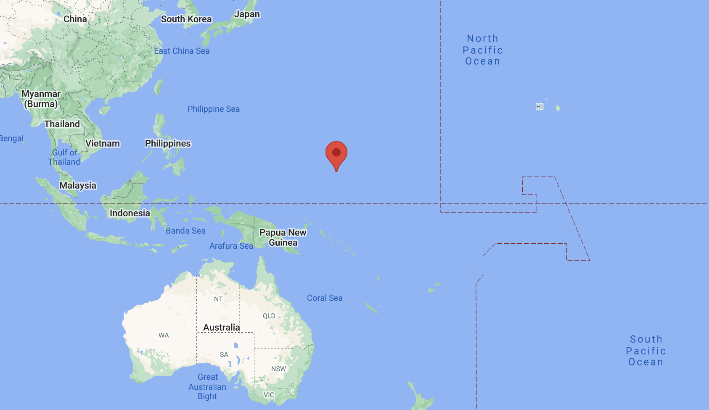

### Teaching

Throughout my career, I have allowed my passions (and a touch of whimsicalness) to guide my career and education. My first foray into the workplace began in Pohnpei, Federated States of Micronesia (FSM), nearly 8,000 miles from my hometown of Buffalo, NY, volunteering as a high school math teacher and later, as a program field director. To fully capture my experience in words would require a tome, but this [video](youtube.com/watch?v=2daPSMtq5Os) offers a somewhat adequate synopsis.

I learned a great deal about culture; the value of quality education; and, through several student tragedies, the need for an increased focus on mental health in the youth environment.

Returning to Buffalo with these lessons led me to working as a mentor for at-risk youth across several urban schools.

### Public Health

Shortly after taking on this position, I realized that addressing city-level upstream factors affecting students, schools, and communities had vast potential for improving the lives of young people, which eventually led to me pursuing a Master of Public Health degree at Columbia University.

Focusing my studies on epidemiology, global health, and mental health allowed me to obtain an epidemiology internship with one of India's most renowned mental health non-profits, [Sangath](https://sangath.in/), which was co-founded by one of my global mental health heroes, Dr. Vikram Patel. I was fortunate to work across multiple research projects, including a pilot RCT for an intervention supporting individuals suffering domestic abuse, as well a Delphi study to develop content for a mobile-based brief intervention for alcohol use.